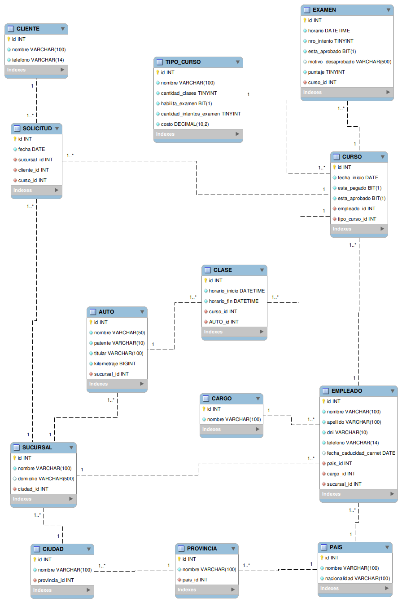

# Trabajo Final Asignatura Base de Datos

El trabajo final de la materia consiste en un trabajo integrador de los conceptos recorridos durante el cursado.

Para ello se creará un modelo de datos en una base de datos relacional que refleje los requerimientos planteados.

## Problema

Se plantea el siguiente problema a modelar:

> **Escuela de Conductores**
>
> La escuela de conductores cuenta con varias sucursales distribuidas en toda la Patagonia. Cada sucursal tiene un supervisor, que a su vez es instructor de manejo experto. En la sucursal hay varios instructores expertos, algunos instructores junior y uno o dos administrativos.
>
> Cuando una persona quiere hacer un curso de manejo debe acercarse a la sucursal, registrarse rellenando un formulario de solicitud. Una vez dado de alta, se le asigna un instructor con el cual tiene una entrevista inicial para conocerse. Luego de la entrevista, se agenda la primera clase teórico-próctica. Luego de cada clase, la persona que está tomando el curso puede puntuar al instructor y dejar un comentario.
>
> Las personas pueden contratar clases de prácticas sueltas, cursos rápidos de 4 clases, o cursos regulares de 12 clases.
>
> Cada sucursal tiene entre 2 y 3 autos para las prácticas. Para cada clase se debe reservar un auto indicando el rango horario asignado a la clase.
>
> La escuela tiene convenios para tomar el examen oficial para sacar el registro de conducir. Este examen solo pueden tomarlo quienes hicieron un curso de manejo, no así los que tomaron clases sueltas. Cuando un alumno termina el curso de manejo, el instructor lo habilita (o no) para realizar el examen. Si estí habilitado, el alumno puede solicitar un turno para rendirlo. El examen consta de una parte práctica y una parte teórica. La escuela lleva el registro de todos los exámenes y el estado (aprobado, desaprobado). En caso de los exámenes no aprobados, se debe registrar el motivo, y se le da al alumno una segunda oportunidad para rendir.
>
> Algunos ejemplos de consultas que se van a requerir:
>
> - Direccián de todas las sucursales y nombre y telófono del supervisor
> - Detalle de los instructores cuyo carnet de conducir está próximo a vencerse
> - Contacto de los alumnos para llamarlos y recordarles el turno de su próxima clase
> - Cantidad de alumnos que reprobaron los exámenes de manejo en el último mes
> - Disponibilidad de autos la semana próxima
> - Ingresos en concepto de clases sueltas por sucursal en el último año
> - Reporte de instructores indicando para el último trimestre, la cantidad de clases dadas y puntaje obtenido
> - Reporte de los vehículos indicando patente, titular, kilometraje, y sucursal donde se encuentra
> - Reporte de estadísticas de alumnos que tomaron cursos, cuántos de ellos rindieron el examen de manejo (una o dos veces), y las notas de los exámenes

## Consigna

1. Crear un modelo de datos para el problema **Escuela de Conductores**
2. Incorporar un conjunto de datos al modelo
3. Resolver las consultas planteadas en la definición del problema

## Entrega final

1. Modelo de datos

    

El modelo de datos propuesto se encuentra en el siguiente archivo:

> - [Autoescuela_DDL_v2021.06.12.sql](./Autoescuela_DDL_v2021.06.12.sql)
