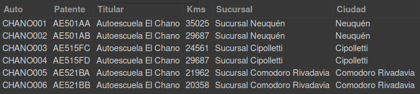

# Trabajo Final Asignatura Base de Datos

El trabajo final de la materia consiste en un trabajo integrador de los conceptos recorridos durante el cursado.

Para ello se diseñará y creará una base de datos que refleje los requerimientos planteados.

## Problema

---

Se plantea el siguiente problema a modelar:

> **Escuela de Conductores**
>
> La escuela de conductores cuenta con varias sucursales distribuidas en toda la Patagonia. Cada sucursal tiene un supervisor, que a su vez es instructor de manejo experto. En la sucursal hay varios instructores expertos, algunos instructores junior y uno o dos administrativos.
>
> Cuando una persona quiere hacer un curso de manejo debe acercarse a la sucursal, registrarse rellenando un formulario de solicitud. Una vez dado de alta, se le asigna un instructor con el cual tiene una entrevista inicial para conocerse. Luego de la entrevista, se agenda la primera clase teórico-próctica. Luego de cada clase, la persona que está tomando el curso puede puntuar al instructor y dejar un comentario.
>
> Las personas pueden contratar clases de prácticas sueltas, cursos rápidos de 4 clases, o cursos regulares de 12 clases.
>
> Cada sucursal tiene entre 2 y 3 autos para las prácticas. Para cada clase se debe reservar un auto indicando el rango horario asignado a la clase.
>
> La escuela tiene convenios para tomar el examen oficial para sacar el registro de conducir. Este examen solo pueden tomarlo quienes hicieron un curso de manejo, no así los que tomaron clases sueltas. Cuando un alumno termina el curso de manejo, el instructor lo habilita (o no) para realizar el examen. Si estí habilitado, el alumno puede solicitar un turno para rendirlo. El examen consta de una parte práctica y una parte teórica. La escuela lleva el registro de todos los exámenes y el estado (aprobado, desaprobado). En caso de los exámenes no aprobados, se debe registrar el motivo, y se le da al alumno una segunda oportunidad para rendir.
>
> Algunos ejemplos de consultas que se van a requerir:
>
> - Dirección de todas las sucursales y nombre y teléfono del supervisor
> - Detalle de los instructores cuyo carnet de conducir está próximo a vencerse
> - Contacto de los alumnos para llamarlos y recordarles el turno de su próxima clase
> - Cantidad de alumnos que reprobaron los exámenes de manejo en el último mes
> - Disponibilidad de autos la semana próxima
> - Ingresos en concepto de clases sueltas por sucursal en el último año
> - Reporte de instructores indicando para el último trimestre, la cantidad de clases dadas y puntaje obtenido
> - Reporte de los vehículos indicando patente, titular, kilometraje, y sucursal donde se encuentra
> - Reporte de estadísticas de alumnos que tomaron cursos, cuántos de ellos rindieron el examen de manejo (una o dos veces), y las notas de los exámenes

## Consigna

---

1. Diseñar y construir una base de datos para el problema **Escuela de Conductores**
2. La base de datos debe contener al menos:
   - 4 tablas, todas relacionadas entre sí
   - Primary keys (PK), foreign keys (FK)
   - 2 atributos de tipo DATE
   - 2 atributos de tipo numérico
   - Un atributo not null, un atributo null
   - 2 atributos con valor DEFAULT
3. Generar el script de creacién de la base de datos, y ejecutarlo.
4. Insertar al menos 20 registros en la base de datos (operación INSERT). Todas las tablas deben tener datos
5. Actualizar al menos 3 registros de la base de dato (operación UPDATE).
6. Borrar 1 registro de la base de datos (operación DELETE).
7. Guardar todas las operaciones DML realizadas (INSERT, UPDATE, DELETE) en un archivo SQL.
8. Realizar al menos 10 consultas sobre la base de datos, usando por lo menos una vez cada una de las cláusulas vistas:
   - WHERE, SORT, ORDER BY, LIMIT, JOIN, GROUP BY/HAVING
9. Crear un documento y, para cada una de las consultas, colocar:
   - El propósito de la misma
   - La sentencia SELECT
   - Una captura de pantalla del resultado obtenido

## Entrega final

---

### Modelo de datos y carga inicial de datos

<div align="center">
    
</div>

El modelo de datos propuesto se encuentra en el siguiente archivo:

- [Autoescuela_DDL_v2021.06.12.sql](./sql/Autoescuela_DDL_v2021.06.12.sql)

La carga inicial de datos se realizará mediante sentencias INSERT incluidas en el archivo mencionado.

---

### Altas, bajas y modificaciones de registros

Las operaciones DML se encuentran en el siguiente archivo:

- [Autoescuela_DML_v2021.06.12.sql](./sql/Autoescuela_DML_v2021.06.12.sql)

---

### Consultas de datos varios

Las operaciones de consulta se encuentran en el siguiente archivo:

- [Autoescuela_Consultas_v2021.06.12.sql](./sql/Autoescuela_Consultas_v2021.06.12.sql)

A continuación se presentan las consultas realizadas y sus resultados

1. Dirección de todas las sucursales y nombre y teléfono del supervisor

```sql
SELECT
    s.nombre as Sucursal,
    s.domicilio as Domicilio,
    c.nombre as Localidad,
    concat(e.apellido, ', ', e.nombre) as Supervisor,
    e.telefono as Telefono
FROM SUCURSAL s
    INNER JOIN CIUDAD c on s.ciudad_id = c.id
    INNER JOIN EMPLEADO e on s.id = e.sucursal_id
WHERE e.es_supervisor = 1;
```

<div align="center">
    
</div>

---

2. Detalle de los instructores cuyo carnet de conducir está próximo a vencerse (para este ejercicio, se toma _"próximo"_ como _"en menos de un año"_)

```sql
SELECT
    concat(e.apellido, ', ', e.nombre) as Instructor,
    e.dni as DNI,
    e.telefono as Telefono,
    c.nombre as Cargo,
    s.nombre as Sucursal,
    e.fecha_caducidad_carnet as 'Fecha Caducidad Carnet',
    CASE WHEN e.fecha_caducidad_carnet < CURDATE()
        THEN 'CADUCADO'
        ELSE DATEDIFF(DATE_ADD(CURDATE(), INTERVAL 1 YEAR), e.fecha_caducidad_carnet)
    END as 'Dias hasta caducar'
FROM EMPLEADO e
    INNER JOIN CARGO c on e.cargo_id = c.id
    INNER JOIN SUCURSAL s on e.sucursal_id = s.id
WHERE c.nombre LIKE '%Instructor%' AND
    e.fecha_caducidad_carnet <= DATE_ADD(CURDATE(), INTERVAL 1 YEAR);
```

<div align="center">
    
</div>

---

3. Contacto de los alumnos para llamarlos y recordarles el turno de su próxima clase (para este ejercicio, se llamará a los que tengan una clase dentro de los próximos 30 días)

```sql
SELECT
    c.nombre as Cliente,
    c.telefono as Telefono,
    pc.prox_clase as 'Horario Próxima Clase'
FROM CLIENTE c
    INNER JOIN
        (SELECT s.cliente_id, MIN(cl.horario_inicio) as prox_clase
        FROM SOLICITUD s
            INNER JOIN CURSO cu on cu.id = s.curso_id
            INNER JOIN CLASE cl on cl.curso_id = cu.id
        WHERE cl.horario_inicio BETWEEN CURDATE() AND DATE_ADD(CURDATE(), INTERVAL 1 MONTH)
        GROUP BY s.cliente_id
        ) pc on pc.cliente_id = c.id
ORDER BY c.id, pc.prox_clase;
```

<div align="center">
    
</div>

---

4.  Contacto de los alumnos para llamarlos y gestionar el cobro de curso solicitado

```sql
SELECT
    c.nombre as Cliente,
    c.telefono as Telefono,
    tc.nombre as 'Curso Pendiente',
    tc.costo as 'Costo Pendiente'
FROM CLIENTE c
    INNER JOIN SOLICITUD s on s.cliente_id = c.id
    INNER JOIN CURSO cu on cu.id = s.curso_id
    INNER JOIN TIPO_CURSO tc on tc.id = cu.tipo_curso_id
WHERE cu.esta_pagado = 0;
```

<div align="center">
    
</div>

---

5.  Cantidad de alumnos que reprobaron los exámenes de manejo en el último mes

```sql
SELECT
    count(*) as 'Cantidad Desaprobados'
FROM CLIENTE c
    INNER JOIN SOLICITUD s on s.cliente_id = c.id
    INNER JOIN CURSO cu on cu.id = s.curso_id
    INNER JOIN EXAMEN e on e.curso_id = cu.id
WHERE e.esta_aprobado = 0 AND
    e.horario BETWEEN DATE_ADD(CURDATE(), INTERVAL -1 MONTH) AND CURDATE();
```

<div align="center">
    
</div>

---

6.  Disponibilidad de autos la semana próxima (para este ejercicio, se considera que un auto está disponible cuando tiene entre 1 y 10 horas disponibles dentro de la semana)

```sql
SELECT
    a.nombre as Auto,
    a.patente as Patente,
    s.nombre as Sucursal,
    CASE WHEN h.horas IS NULL THEN 10 ELSE 10 - h.horas END as 'Horas Disponibles'
FROM AUTO a
    INNER JOIN SUCURSAL s on s.id = a.sucursal_id
    LEFT JOIN (
        SELECT c.auto_id, SUM(Hour(TIMEDIFF(c.horario_fin, c.horario_inicio))) as horas
        FROM CLASE c
        WHERE c.horario_inicio BETWEEN CURDATE() AND DATE_ADD(CURDATE(), INTERVAL 1 WEEK)
        GROUP BY c.auto_id
        HAVING SUM(Hour(TIMEDIFF(c.horario_fin, c.horario_inicio))) <= 10) h on a.id = h.auto_id;
```

<div align="center">
    
</div>

---

7.  Ingresos en concepto de clases sueltas por sucursal en el último año

```sql
SELECT SUM(tc.costo) as 'Ingresos Clases Sueltas'
FROM CURSO c
    INNER JOIN TIPO_CURSO tc on tc.id = c.tipo_curso_id
WHERE c.esta_pagado = 1 AND
    c.tipo_curso_id = 1 AND
    c.fecha_inicio BETWEEN DATE_ADD(CURDATE(), INTERVAL -1 YEAR) AND CURDATE();
```

<div align="center">
    
</div>

---

8.  Reporte de instructores indicando para el último trimestre, la cantidad de clases dadas y puntaje obtenido

```sql
SELECT
    concat(e.apellido, ', ', e.nombre) as Instructor,
    ca.nombre as Cargo,
    CASE WHEN cl.clases is null
        THEN 0
        ELSE cl.clases
    END as 'Cantidad Clases',
    CASE WHEN cl.promedio is null
        THEN 0
        ELSE cl.promedio
    END as 'Puntaje Promedio'
FROM EMPLEADO e
    INNER JOIN CARGO ca on ca.id = e.cargo_id
    LEFT JOIN
        (SELECT cu.empleado_id, count(c.id) clases, round(avg(com.puntaje),2) as promedio
        FROM CLASE c
            INNER JOIN CURSO cu on cu.id = c.curso_id
            LEFT JOIN COMENTARIO com on com.clase_id = c.id
        WHERE c.horario_inicio BETWEEN DATE_ADD(CURDATE(), INTERVAL -3 MONTH) AND CURDATE()
        GROUP BY cu.empleado_id) cl on e.id = cl.empleado_id
WHERE ca.nombre LIKE '%Instructor%'
ORDER BY 3 desc,4 desc;
```

<div align="center">
    
</div>

---

9.  Reporte de los vehículos indicando patente, titular, kilometraje, y sucursal donde se encuentra

```sql
SELECT
    a.nombre as Auto,
    a.patente as Patente,
    a.titular as Titular,
    a.kilometraje as Kms,
    s.nombre as Sucursal,
    c.nombre as Ciudad
FROM AUTO a
    INNER JOIN SUCURSAL s on s.id = a.sucursal_id
    INNER JOIN CIUDAD c on c.id = s.ciudad_id;
```

<div align="center">
    
</div>

---

10. Agenda de clases de la próxima semana con instructor, auto y cliente

```sql
SELECT
    c.id as 'Código Clase',
    c.horario_inicio as Horario,
    time_format(timediff(c.horario_fin, c.horario_inicio), "%H %i") as Duracion,
    concat(e.apellido, ', ', e.nombre) as Instructor,
    e.telefono as 'Teléfono Instructor',
    a.nombre as Auto,
    a.patente as Patente,
    cl.nombre as Cliente,
    cl.telefono as 'Teléfono Cliente'
FROM CLASE c
    INNER JOIN CURSO cu on cu.id = c.curso_id
    INNER JOIN EMPLEADO e on e.id = cu.empleado_id
    INNER JOIN AUTO a on a.id = c.auto_id
    INNER JOIN SOLICITUD s on s.curso_id = cu.id
    INNER JOIN CLIENTE cl on cl.id = s.cliente_id
WHERE c.horario_inicio between CURDATE() AND DATE_ADD(CURDATE(), INTERVAL 10 WEEK)
ORDER BY c.horario_inicio;
```

<div align="center">
    
</div>
